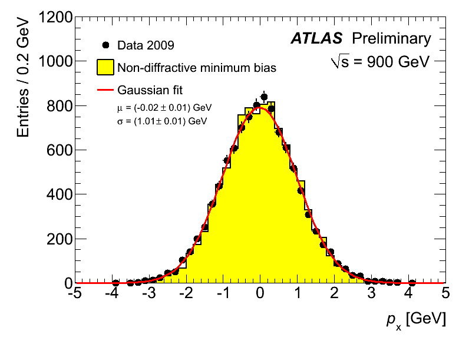
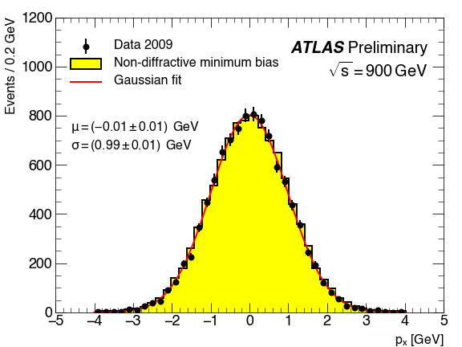
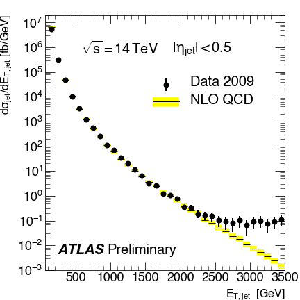

Examples
========
Examples which reproduce the plots on this page (https://twiki.cern.ch/twiki/bin/viewauth/AtlasProtected/PubComPlotStyle) are included in the ``examples`` folder.
The text below goes through these in some more detail and explains what each line is doing.

1. Basic data and prediction plot
---------------------------------
Import necessary packages

.. code:: python

    import numpy as np
    import ROOT
    import mATLASplotlib

Generate some ROOT data - MC prediction

.. code:: python

    # MC prediction
    hpx_MC = ROOT.TH1F("hpx_MC", "This is the MC px distribution", 40, -4, 4)
    for x in np.random.normal(size=50000):
        hpx_MC.Fill(x, 0.2)

    # Pseudodata
    hpx_data = ROOT.TH1F("hpx_data", "This is the data px distribution", 40, -4, 4)
    for x in np.random.normal(size=10000):
        hpx_data.Fill(x)

    print "Data integral, max", hpx_data.Integral(), hpx_data.GetMaximum()

Now we fit the data (using ROOT again)

.. code:: python

    fit_fn = ROOT.TF1("fit_fn", "gaus", -4, 4)
    hpx_data.Fit(fit_fn, "LEMN")
    mu, sigma = fit_fn.GetParameter(1), fit_fn.GetParameter(2)
    mu_err, sigma_err = fit_fn.GetParError(1), fit_fn.GetParError(2)

Open a canvas as a context manager and plot these three datasets

.. code:: python

    with mATLASplotlib.canvases.Simple(shape="landscape") as canvas:
        canvas.plot_dataset(hpx_data, style="scatter yerror", label="Data 2009", colour="black")
        canvas.plot_dataset(hpx_MC, style="bar", label="Non-diffractive minimum bias", colour="#ffff00", edgecolour="black")
        canvas.plot_dataset(fit_fn, style="smooth line", label="Gaussian fit", colour="red")

Note that three different styles are used here: :py:class:`scatter <.Scatter>`, :py:class:`bar <.BarChart>` and :py:class:`line <.Line>`.
The additional words in these arguments: ``yerror`` and ``smooth`` specify particular additional plotting properties - namely error bars in the y-direction and a smooth interpolation between the points.

The ``label`` argument to :py:meth:`plot_dataset <.BaseCanvas.plot_dataset>` is used to build the legend which can then be drawn in one line

.. code:: python

    canvas.add_legend(0.04, 0.92, fontsize=16, anchor_to="upper left")

Now some arbitrary text can be drawn on the plot, including two special pieces of text needed for ATLAS plots - the ATLAS label and the luminosity.

.. code:: python

    canvas.add_text(0.04, 0.6, "$\mu = ({{{0:.2f}}}\pm{{{1:.2f}}})\,$ GeV\n$\sigma = ({{{0:.2f}}}\pm{{{1:.2f}}})\,$ GeV".format(mu, mu_err, sigma, sigma_err), fontsize=16)
    canvas.add_ATLAS_label(0.96, 0.92, fontsize=20, plot_type="Preliminary", anchor_to="upper right")
    canvas.add_luminosity_label(0.96, 0.85, fontsize=20, sqrts_TeV=0.9, luminosity=None, anchor_to="upper right")

The axis titles are set according to the data being used

.. code:: python

    canvas.set_axis_label("x", "$p_x$ [GeV]")
    canvas.set_axis_label("y", "Events / 0.2 GeV")

Here the ranges are explicitly defined. Without this, the ``matplotlib`` defaults (which are usually good) will be used.

.. code:: python

    canvas.set_axis_range("x", (-5.0, 5.0))
    canvas.set_axis_range("y", (0, 1200))

Here the default choice of axis labels on the x-axis is overridden to match the reference image

.. code:: python

    canvas.set_axis_ticks("x", [-5, -4, -3, -2, -1, 0, 1, 2, 3, 4, 5])

And the file is saved

.. code:: python

    canvas.save("example_fig_01")

The left-hand image is from the official ATLAS guide, the one on the right uses ``mATLASplotlib``

1. More complicated - theory band and log-scale
-----------------------------------------------
Import necessary packages

.. code:: python

    from mATLASplotlib import canvases
    import array
    import ROOT
    import numpy as np

Load distributions (these numbers are from the example ROOT file produced by ATLAS)

.. code:: python

    # Take the NLO QCD prediction from the ATLAS ROOT file
    NLOQCD_x = array.array("d", [150, 250, 350, 450, 550, 650, 750, 850, 950, 1050, 1150, 1250, 1350, 1450, 1550, 1650, 1750, 1850, 1950, 2050, 2150, 2250, 2350, 2450, 2550, 2650, 2750, 2850, 2950, 3050, 3150, 3250, 3350, 3450, 3550, 3650, 3750, 3850, 3950, 4050, 4150, 4250, 4350, 4450, 4550, 4650, 4750, 4850, 4950, 5050, 5150, 5250, 5350, 5450, 5550, 5650, 5750, 5850, 5950, 6050, 6150, 6250, 6350, 6450, 6550, 6650, 6750, 6850, 6950])
    NLOQCD_ex = array.array("d", [50] * len(NLOQCD_x))
    NLOQCD_y = array.array("d", [6.6596e+06, 318321, 48380.3, 10957.2, 3235.47, 1232.35, 512.05, 230.488, 114.084, 60.5025, 31.1572, 17.6683, 10.3007, 6.14975, 3.71552, 2.52298, 1.44746, 1.01675, 0.641863, 0.38725, 0.263351, 0.207581, 0.103852, 0.0813621, 0.0507964, 0.0374186, 0.0239413, 0.0179119, 0.0105439, 0.00724193, 0.00513062, 0.00353234, 0.00237385, 0.00137003, 0.000949618, 0.000670692, 0.000455441, 0.000278849, 0.000175337, 0.000121832, 8.35938e-05, 4.20491e-05, 2.53419e-05, 1.83e-05, 1.05427e-05, 5.73383e-06, 3.57256e-06, 2.47147e-06, 1.32182e-06, 5.26587e-07, 3.89889e-07, 1.85564e-07, 1.05617e-07, 5.02298e-08, 2.37682e-08, 1.00941e-08, 4.17607e-09, 1.74077e-09, 6.47905e-10, 2.90492e-10, 8.31421e-11, 2.45835e-11, 5.51966e-12, 1.23854e-12, 2.12108e-13, 3.51307e-14, 3.83912e-15, 2.02972e-16, 1.93257e-17])
    NLOQCD_eyl = array.array("d", [592438, 26408.5, 4624.47, 1045.14, 310.249, 132.484, 57.4808, 26.5156, 13.8826, 7.8785, 3.91181, 2.34453, 1.39327, 0.857228, 0.534341, 0.386117, 0.211819, 0.15815, 0.101274, 0.0583714, 0.0418432, 0.0364608, 0.0162442, 0.0134506, 0.00859996, 0.00647774, 0.0042077, 0.00337713, 0.00183224, 0.00130241, 0.000980045, 0.000692273, 0.000480861, 0.00027158, 0.000186696, 0.000140853, 9.95418e-05, 6.30202e-05, 3.98933e-05, 2.87898e-05, 2.16196e-05, 1.04431e-05, 6.53897e-06, 5.1248e-06, 3.04996e-06, 1.71619e-06, 1.10496e-06, 8.44941e-07, 4.69963e-07, 1.85741e-07, 1.51345e-07, 7.70224e-08, 4.67813e-08, 2.32868e-08, 1.17352e-08, 5.41192e-09, 2.35221e-09, 1.05666e-09, 4.15396e-10, 2.01271e-10, 6.30795e-11, 1.97053e-11, 4.85011e-12, 1.15449e-12, 2.10144e-13, 3.78813e-14, 4.13635e-15, 2.06829e-16, 1.87872e-17])
    NLOQCD_eyh = array.array("d", [476290, 17188.1, 3472.85, 756.231, 234.15, 115.386, 53.9145, 26.1371, 14.5604, 8.67245, 4.40793, 2.79054, 1.68753, 1.07432, 0.691266, 0.496964, 0.292805, 0.212455, 0.140897, 0.0844782, 0.0623834, 0.0518593, 0.0270745, 0.0203713, 0.0140546, 0.0102316, 0.0069444, 0.00551092, 0.0030732, 0.00229263, 0.00169067, 0.00117577, 0.000835395, 0.000520959, 0.000336736, 0.000257673, 0.00017855, 0.000120173, 7.67702e-05, 5.03502e-05, 3.96392e-05, 2.10842e-05, 1.32891e-05, 9.44563e-06, 5.76911e-06, 3.43875e-06, 2.11638e-06, 1.48622e-06, 7.97241e-07, 4.54554e-07, 2.77689e-07, 1.50687e-07, 8.06223e-08, 4.46708e-08, 2.25211e-08, 1.1174e-08, 4.73384e-09, 2.2669e-09, 9.73032e-10, 4.7206e-10, 1.81057e-10, 7.06126e-11, 2.27797e-11, 7.87034e-12, 2.46757e-12, 7.2124e-13, 1.37511e-13, 1.14176e-14, 1.02065e-15])
    g_NLOQCD = ROOT.TGraphAsymmErrors(len(NLOQCD_x), NLOQCD_x, NLOQCD_y, NLOQCD_ex, NLOQCD_ex, NLOQCD_eyl, NLOQCD_eyh)

Generate some data which looks like the QCD background plus a small amount of signal

.. code:: python

    # Generate some ROOT data based on the NLO QCD prediction
    h_data = ROOT.TH1F("hpx_data", "This is the data px distribution", 69, 100, 7000)
    r1 = 0.4 * (np.random.uniform(size=len(NLOQCD_x)) + 2)
    r2 = 0.4 * (np.random.uniform(size=len(NLOQCD_x)) + 2)
    for x, y, _r1, _r2 in zip(NLOQCD_x, NLOQCD_y, r1, r2):
        data_y = _r1 * y + _r1 *_r2**2 * x / 50000.
        h_data.SetBinContent(h_data.FindFixBin(x), data_y)
        h_data.SetBinError(h_data.FindFixBin(x), np.sqrt(data_y * 1000) / 200.)

Open a canvas and plot the datasets

.. code:: python

    with mATLASplotlib.canvases.Simple(shape="square") as canvas:
        canvas.plot_dataset(h_data, style="scatter yerror", label="Data 2009", colour="black")
        canvas.plot_dataset(g_NLOQCD, style="binned band central line", label="NLO QCD", colour="#ffff00", line_colour="black")

next the legend and text

.. code:: python

    canvas.add_legend(0.45, 0.75, fontsize=20, anchor_to="upper left")
    canvas.add_luminosity_label(0.15, 0.9, fontsize=20, sqrts_TeV=14, luminosity=None, anchor_to="upper left")
    canvas.add_text(0.53, 0.9, r"$|\eta_{jet}| < 0.5$", fontsize=20, anchor_to="upper left")
    canvas.add_ATLAS_label(0.05, 0.05, fontsize=20, plot_type="Preliminary", anchor_to="lower left")

and the axis titles and ranges.

.. code:: python

    canvas.set_axis_label("x", r"$E_{T,jet}$  [GeV]")
    canvas.set_axis_label("y", r"$d\sigma_{jet}/dE_{T,jet}$ [fb/GeV]")
    canvas.set_axis_range("x", (60.0, 3500.0))
    canvas.set_axis_range("y", (1e-3, 2e7))

For this plot we want the y-axis to be on a log-scale and to specify the ticks

.. code:: python

    canvas.set_axis_log("y")
    canvas.set_axis_ticks("x", [500, 1000, 1500, 2000, 2500, 3000, 3500])
    canvas.set_axis_ticks("y", [1e-3, 1e-2, 1e-1, 1, 10, 1e2, 1e3, 1e4, 1e5, 1e6, 1e7])

Finally save it

.. code:: python

    canvas.save("example_fig_02", extension="png")

.. image:: images/example_fig_02_official.png
   :width: 49%

As before, the left-hand image is from the official ATLAS guide, the one on the right uses ``mATLASplotlib``
