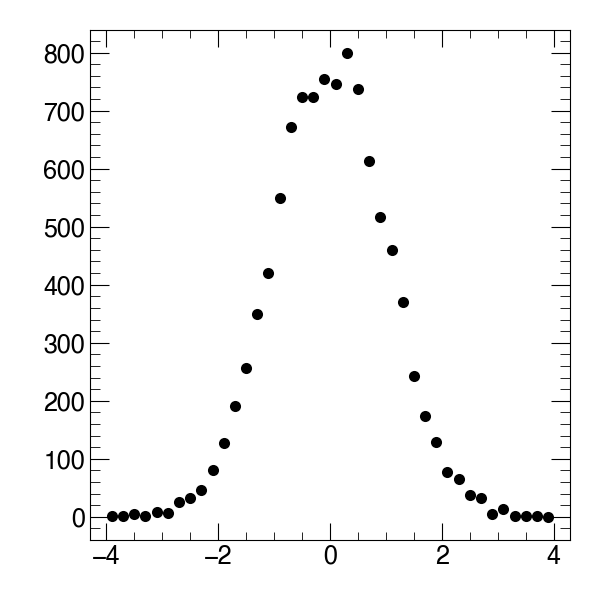

Getting Started
===============

1. Validate installation
------------------------
After following the installation instructions, ``mATLASplotlib`` should be available at the ``python`` prompt

.. code:: python

    >>> import mATLASplotlib

The user interface of ``mATLASplotlib`` is centered on a ``canvas`` on which datasets can be plotted.

2. Setting up a canvas
----------------------
Currently the supported canvases are the ``Simple`` canvas which contains one set of ``matplotlib`` axes and the ``Ratio`` canvas, which contains a main plot and a ratio plot underneath.

.. code:: python

    from mATLASplotlib import canvases
    canvas = canvases.Simple(shape="square")

The two shapes preferred in the ATLAS style guide are "square" (600 x 600 pixels) and "landscape" (600 x 800 pixels).
Here we have chosen to use "square".

3. Adding some data to the canvas
---------------------------------
Now we need some data, let's construct some using ``ROOT`` and ``numpy``

.. code:: python

    import numpy as np
    import ROOT
    hist = ROOT.TH1F("Generated data", "This is some autogenerated data", 40, -4, 4)
    for x in np.random.normal(size=10000):
        hist.Fill(x)

this should have drawn 10000 samples from a normal distribution and added them to a ROOT histogram.
We can now plot this using the ``plot_dataset()`` method

.. code:: python

    canvas.plot_dataset(hist, style="scatter", label="Generated data", colour="black")

4. Plotting options
-------------------
The different ``style`` options specify how the data should be displayed. Options are

- ``bar`` (a histogram or bar chart)
- ``binned band`` (a band with a fill colour in between the maximum and minimum values in each bin)
- ``coloured_2D`` (a 2D histogram with a colour-scale to indicate the 'z' value in each bin)
- ``line`` (a single line, either smooth or consisting of straight line segments)
- ``scatter`` (a scatter plot - often used for data points)
- ``stack`` (one of a series of histograms that should be summed up when drawn)

Other options like ``linestyle`` and ``colour`` can be used to distinguish different datasets.

5. Saving the canvas to a file
------------------------------
Saving the output to a file is very simple.

.. code:: python

    canvas.save_to_file("simple_example")

This function takes an optional ``extension`` argument which sets the file extension of the output file.
Running this code will produce a minimal scatter plot with automatically determined axis limits and save this to a PDF (if not otherwise specified).
The output should be similar to that shown in the image below.

    Sample output
